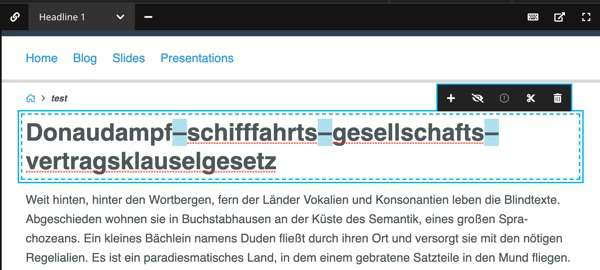
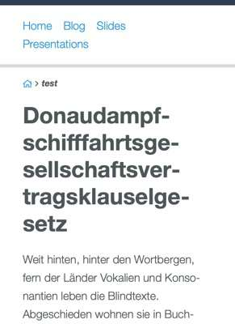
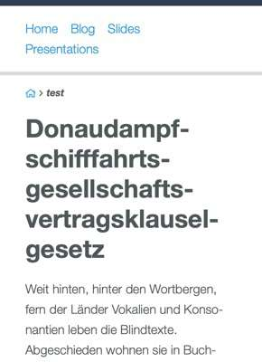
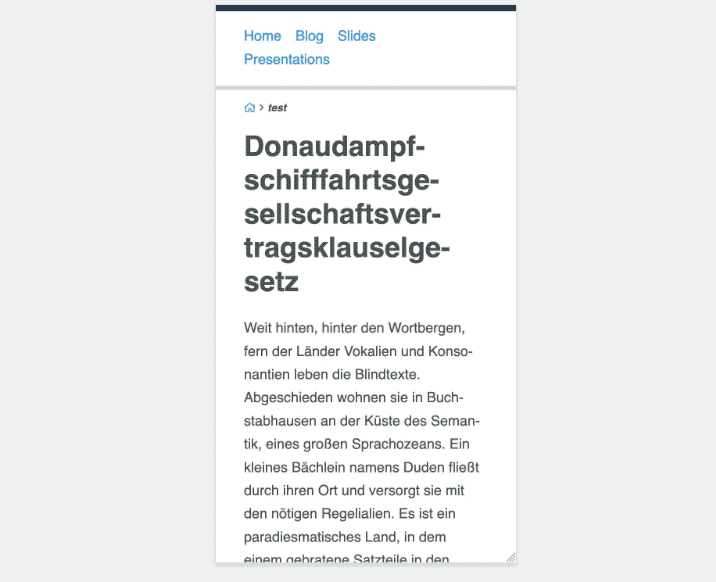

# Hyphens CKEditor5 plugin for Neos CMS   

## Introduction

This package provides a button to insert soft hyphens for the inline editor in Neos CMS.

Many browser support some kind of hyphenation via CSS but it doesnt work reliably on all systems 
and not with all languages. See the [CanIuse](https://caniuse.com/#feat=css-hyphens) table for details.

Therefore this package provides a manual way to insert them. You should be careful with using the 
CSS based hyphenation in combination with the manual hyphens as the result can be unexpected.

It's compatible with Neos CMS 3.3 and 4.x with the Neos.Ui 2+.

## Example           

In the backend this plugin will add the option to add soft hyphens. They will look like this while editing:

       
       
And in the frontend will convert this:

Into this:

And in action:

                            
                
## Advantages

* Your editors gain control over word breaks.
* Stores the hyphens in the database with their UTF8 representation which the browser interprets as `&shy;`.
* You don't need other characters which you replace with hyphens in the Frontend.
* Should work fine with Elasticsearch and other search engines.

### Planned features

See [enhancement issue list](https://github.com/Sebobo/Shel.Neos.Hyphens/issues?utf8=✓&q=is%3Aissue+label%3Aenhancement+).

## Installation

Run this in your site package

    composer require --no-update shel/neos-hyphens
    
Then run `composer update` in your project directory.

## How to use

Enable it for a node with editable text like this:

    'Neos.NodeTypes:Text':
      properties:
        text:
          ui:
            inline:
              editorOptions:
                hyphens: true
                
## Customization

### Hyphen styling in the backend

You can provide your own styling by referencing your own stylesheet.
See the file `Override.Page.fusion` on how the default styling is included.

You can either override the configuration from your own package and just use your stylesheet
or you can add yours and use both. 

## Contributions

Contributions are very welcome! 

Please create detailed issues and PRs.  

**If you use this package and want to support or speed up it's development, [get in touch with me](mailto:hyphens@helzle.it).**

Or you can also support me directly via [patreon](https://www.patreon.com/shelzle).

## License

See [License](./LICENSE.txt)
